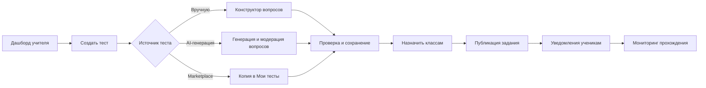

# docs/04_user_flows/teacher_test_creation_assignment.md

> **Проект:** Zedly — SaaS-платформа онлайн-тестирования и аналитики для школ Узбекистана  
> **Файл:** User-flow создания и назначения тестов учителем  
> **Цель флоу:** Учитель создаёт или выбирает тест и назначает его нужным классам за **≤ 7 минут**  
> **Приоритет:** Core / MVP

---

## Обзор флоу



---

## Предусловия

- Учитель авторизован в системе (`role = teacher`).
- У учителя заполнен профиль: предмет и минимум один класс в `teacher_classes`.
- В выбранных классах есть хотя бы один активный ученик.
- У учителя есть permission: `create_test`, `assign_test`, `view_own_results`.

---

## Шаг 1 — Вход в сценарий

### Что делает учитель

1. Открывает `Dashboard`.
2. Нажимает CTA **«Создать тест»** (или «Новый тест» в разделе «Мои тесты»).

### Что делает система

- Открывает мастер создания теста.
- Подставляет дефолтные значения: предмет из профиля учителя, последний использованный класс, язык интерфейса.

### Результат

Учитель попадает на экран выбора источника теста.

---

## Шаг 2 — Выбор источника теста

Система предлагает три равноправных пути:

1. **Создать вручную**
2. **Сгенерировать с AI**
3. **Взять из Marketplace**

### Правило UX

- Если это первый тест учителя, путь **AI** и **Marketplace** визуально выделены как более быстрые.
- Путь **вручную** остаётся доступным без ограничений.

---

## Шаг 3A — Создание вручную

### Actor → System → Response

| Шаг | Actor | Action | System | Response |
|-----|-------|--------|--------|----------|
| 3A.1 | Учитель | Вводит название теста | Валидирует длину (3–120 символов) | Ошибки инлайн при необходимости |
| 3A.2 | Учитель | Выбирает предмет, тему, сложность, лимит времени | Сохраняет метаданные в draft | Черновик получает `draft_id` |
| 3A.3 | Учитель | Добавляет вопросы | Проверяет обязательные поля по типу вопроса | Неполные вопросы подсвечиваются |
| 3A.4 | Учитель | Нажимает «Сохранить» | Проверяет min 1 корректный вопрос | Переход на экран предпросмотра |

### Бизнес-валидации

- Минимум 1 вопрос, максимум 100 вопросов.
- Для MCQ — минимум 2 варианта ответа и минимум 1 правильный.
- Время теста: 5–180 минут.
- Допустимые вложения: `jpg/png/webp`, до 5 MB на вопрос.

---

## Шаг 3B — AI-генерация

| Шаг | Actor | Action | System | Response |
|-----|-------|--------|--------|----------|
| 3B.1 | Учитель | Нажимает «Сгенерировать с AI» | Открывает форму загрузки контента | Выбор: текст или PDF |
| 3B.2 | Учитель | Загружает материал | Валидирует формат (`txt/pdf/docx`) и размер (до 20 MB) | Показывает прогресс анализа |
| 3B.3 | System | — | Генерирует 10–20 вопросов с уровнями сложности | Показывает список предложений |
| 3B.4 | Учитель | Принимает/редактирует/удаляет вопросы | Сохраняет только подтверждённые вопросы | Формируется черновик теста |
| 3B.5 | Учитель | Нажимает «Сохранить тест» | Проводит стандартную валидацию | Переход к предпросмотру |

### Особенность

Если AI вернул слабое качество (например, дубли вопросов), система предлагает кнопку **«Перегенерировать проблемные вопросы»** без потери уже подтверждённых.

---

## Шаг 3C — Использование Marketplace

| Шаг | Actor | Action | System | Response |
|-----|-------|--------|--------|----------|
| 3C.1 | Учитель | Открывает Marketplace | Применяет фильтры по предмету, классу, языку | Показ релевантных тестов |
| 3C.2 | Учитель | Открывает карточку теста | Показывает превью, автора, рейтинг, число попыток | Данные для выбора |
| 3C.3 | Учитель | Нажимает «Использовать» | Создаёт копию в библиотеке учителя | Новый `test_id`, авторство = учитель |
| 3C.4 | Учитель | При необходимости редактирует | Сохраняет изменения в копии | Готовность к назначению |

---

## Шаг 4 — Предпросмотр и публикация теста

### Что видит учитель

- Название, параметры, список вопросов.
- Индикатор покрытия (например, «12 вопросов, 3 темы, средняя сложность: medium»).
- Кнопки: **«Сохранить как черновик»**, **«Назначить классу»**.

### Что делает система

- Проводит финальную серверную валидацию перед назначением.
- Блокирует публикацию при критических ошибках.

---

## Шаг 5 — Назначение теста классам

### Actor → System → Response

| Шаг | Actor | Action | System | Response |
|-----|-------|--------|--------|----------|
| 5.1 | Учитель | Нажимает «Назначить классу» | Открывает модальное окно назначения | Показывает только классы учителя |
| 5.2 | Учитель | Выбирает 1+ классов | Проверяет доступ учителя к каждому классу | Недоступные классы скрыты |
| 5.3 | Учитель | Указывает период доступности | Валидирует даты (`start_at < deadline_at`) | Подсказки по дедлайну |
| 5.4 | Учитель | Выбирает режим прохождения (1 попытка / несколько, random order) | Сохраняет policy | Параметры фиксируются в assignment |
| 5.5 | Учитель | Нажимает «Опубликовать» | Создаёт `test_assignments` + связывает учеников | Возвращает статус «Назначено» |

### Поля назначения

- `class_ids[]`
- `start_at` (опционально)
- `deadline_at` (опционально)
- `attempt_limit` (по умолчанию 1)
- `shuffle_questions` (bool)
- `shuffle_answers` (bool)
- `visibility`: immediately | scheduled

---

## Шаг 6 — Уведомления и доставка задания

После успешного назначения:

1. Система создаёт события уведомлений для всех учеников выбранных классов.
2. Отправляет push/in-app уведомление.
3. При подключённом Telegram-боте отправляет сообщение с deep-link на тест.
4. В карточке задания отображается счётчик: «Открыли / Начали / Завершили».

---

## Шаг 7 — Мониторинг выполнения

Учитель открывает страницу результатов назначения и видит:

- Статус по ученикам: `не начал / в процессе / завершил`.
- Средний балл в реальном времени (после первых завершений).
- Кнопку **«Напомнить не начавшим»**.
- Возможность продлить дедлайн для выбранного класса.

---

## Ошибки и edge-cases

| Ситуация | Что видит учитель | Поведение системы |
|---------|-------------------|-------------------|
| Нет учеников в классе | «В выбранном классе пока нет учеников» | Блокирует назначение в пустой класс |
| Дедлайн в прошлом | Ошибка у поля даты | Не даёт опубликовать |
| Тест уже назначен этим же классам в тот же интервал | Предупреждение о дубликате | Предлагает «Создать копию» или «Продолжить» |
| Потеря сети при публикации | Тост «Проблема с сетью, повторите» | Идемпотентный повтор по `request_id` |
| Недостаточно прав (RBAC) | «У вас нет доступа к этому действию» | HTTP 403 + аудит события |

---

## События аналитики (минимальный набор)

```json
[
  { "event": "teacher_test_create_started", "teacher_id": "...", "source": "manual|ai|marketplace" },
  { "event": "teacher_test_draft_saved", "teacher_id": "...", "questions_count": 12 },
  { "event": "teacher_test_assigned", "teacher_id": "...", "classes_count": 2, "students_count": 54 },
  { "event": "teacher_test_assignment_reminder_sent", "teacher_id": "...", "students_count": 17 }
]
```

---

## Критерии успешности флоу

- P50 time-to-assign (от клика «Создать тест» до «Назначено») ≤ 7 минут.
- Не менее 80% учителей завершают флоу без обращения в поддержку.
- Ошибка публикации (`assign_failed`) < 1% от всех попыток.
- Конверсия из «создание начато» в «назначено» ≥ 65
